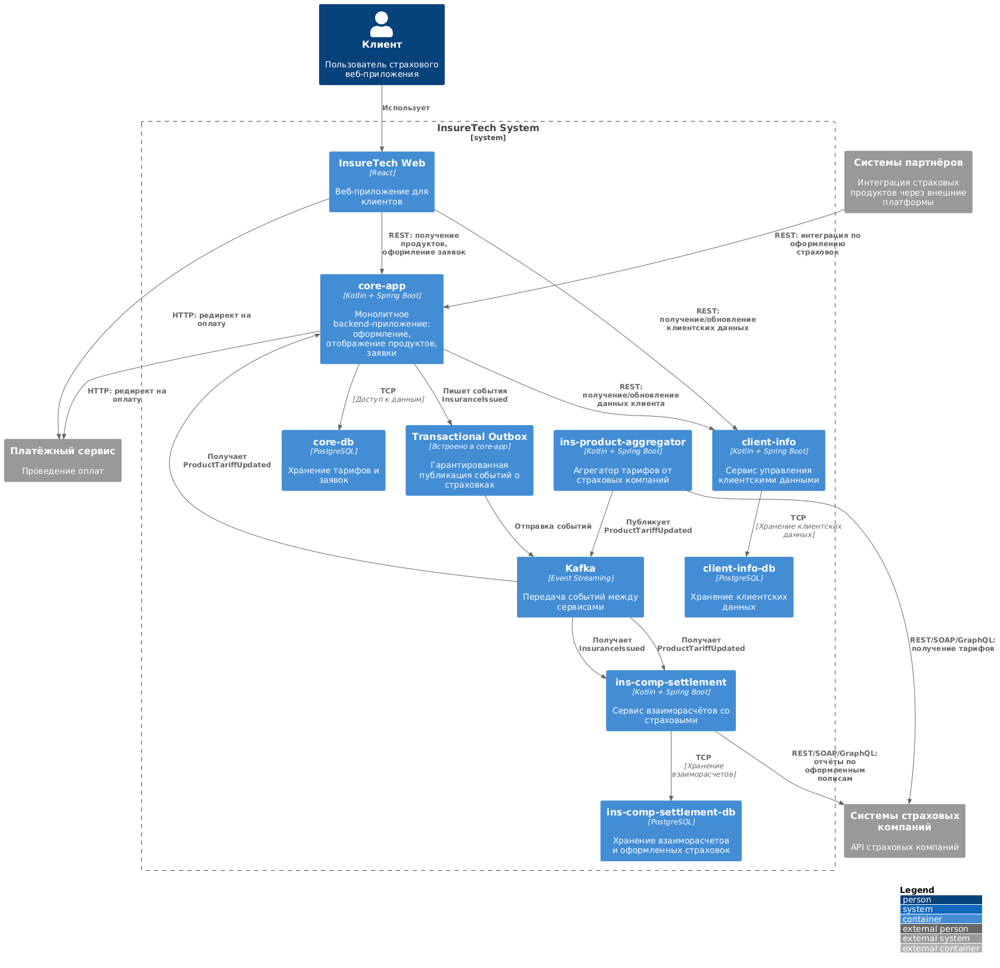

## 1. Анализ текущей архитектуры. Список проблем и рисков
##### Важные замечания:
1) Все обращения к тарифам и продуктам происходят по REST из core-app и ins-comp-settlement к ins-product-aggregator.
2) ins-product-aggregator делает синхронные вызовы ко всем страховым компаниям (5 внешних систем).
3) core-app кэширует тарифы и обновляет их каждые 15 минут.
4) ins-comp-settlement делает запрос к ins-product-aggregator раз в сутки.
5) Также ins-comp-settlement получает данные об оформленных страховках из core-app раз в сутки через REST.

##### Выявленные проблемы:
1) высокая задержка и нестабильность при REST-запросах:
- ins-product-aggregator обращается ко множеству сторонних API — возможны таймауты, ошибки, перегрузки.
- Эти ошибки могут нарушить процесс в core-app и ins-comp-settlement.
2) повторяющиеся запросы и избыточная нагрузка:
все данные кэшируются в каждом сервисе локально, но требуют регулярного опроса и парсинга.
3) плотная связанность сервисов (tight coupling):
core-app и ins-comp-settlement напрямую зависят от доступности и работоспособности ins-product-aggregator.
4) риск масштабирования:
- увеличение числа страховых компаний (до 10) может привести к росту времени агрегации тарифов.
- каждый новый партнёр — дополнительная точка отказа и потенциальная нагрузка.
5) сложности с трассировкой ошибок:
трудно отследить, на каком этапе пропала часть данных (в core-app, ins-product-aggregator или у внешнего API).
6) низкая гибкость обновления данных:
обновление тарифов и продуктов происходит по расписанию, а не по событию.

## 2. Диаграмма контейнеров переделанная
!!!!ВАЖНО!!!!
у меня не удалось открыть в https://app.diagrams.net диаграмму, представенную здесь
https://code.s3.yandex.net/software-architect/InsureTech_C4_%D1%81ontainer-diagram.drawio.xml
т.к. возникает ошибка, решение которой делает схему непригодной для полноценного задания, поэтому я принял решение
сделать задание в удобном для меня https://www.plantuml.com/

[Исходный код диаграммы](InsureTech_C4.txt)

Диаграмма контейнеров переделанная

[Диаграмма контейнеров](https://www.plantuml.com/plantuml/png/fLLFJznM4B_lftZXHDHizf8Jfm11oQgqRDX5KK_exVe15bxRif-ReAfIWT96IbMQjeUggefww7rPC6mNC5zX_8qwy_oyDiuhSfMJ_VxC_7upytipJqF90naDdSO3IspPhc3BJpfiHqe_N6Yr0lxwyROjTw9-58fWuBbIkFBnm1ksV8UxPDOCfUNO_TRoasQ7jZO-MsqDUIX5q7XWkmCdiaGKEEGKhsmkemUE8C5Zdo1N5xzOs-XjlchtNcokhZnV-VpP_CD6eoE2q7Fd1uwDO8_O7FmELp2166xIWpbQdq02L-aFS8dVCOpI0uXfpTBzz23z1ZUEr442Pv0m_8dXj0ctU391HmbSa2kOfCTp2DRTGwx3pIKlSYqUxCtRRXW5Geh13YArrQA72vRTctl8lceq69l5CVzQzEzUV2NwH79Ty85KR7ysusD03CwHzp63QH4WCKTUPOY15uX5tqTVzDValaz-F_MaOxli4zRr0zlTPakUb-7z0GcwJyWbkiC_1EhpmQvmBIEB1GP9-YqaU7AD9tht4UqIcrFAQ9apkKZWF3s4QKONhrvYqezXZ85C3EIVBUNSBPMRZXVAxK1qNwugmdyhX9iP0deT4KqY1MC6ay9_0jEgVwMIjhlb4OPQD6rStPkYlo16W352x3ECurOH6EV1LogIxbDOS4qypeaeRhwZvNyoeNZBN6g5RS1CZqg8wL45Zs-ZisqklG2zeMoRVk1PqK0sYuDxa_0Jd2636Cxe1L7vguad0LJU5D4WeWd6VwkOJU2V2gzGIEc88GQlUM6xy9l5RktAu0VhhbAV40MaydtwFjCSyeAaGivObG8NgsBaKxCw1Z8GQp8mgRuXNR8AGuD-T_dMBgUCq9UGLxv4Jgmh0y67c1hTy2WhCOa1KKSgU3X5W0FAFqFC62xeIU99aK0O6VBXHRBllK6dlO2x8VOestEvmzRKTjQlDEU4mb0Db9Nx3lo295Hk25tT6sSQfJTAxU4GJfMIfxZndNfELRxLoj5LfU_6rxEElF96gcQCD0TYiTDMwg2mLBk_Jj_LaYPQeMrD5PUGVRwd5Op9lw8Nahw72oegyYydEQkFJWDMg11CWhwLPTLp8B4GuOVnu7tCBFLiLBbog9p_fZ8Tqsij9RGQZw4lCwLGqiqboVS65syrkPoQrYoYK_BNXJERkZJN21nZlSt7BRgEAHnrKLsuqttNLxgz1QQl7n9uXjQYufEKgCNMRtTbd684ca7CSyaus2h3fC0eIlwYr-iiCFtY9lGbbumKNYfhUgYjDRcFoqOfy3kfWL4LPJPHUyiT9P1V8I4zq213qpj3gchxyJ7E-WUSeDbR4aJvUPCus_chROTX92pj8JVC6nxyYTVpoJlzeAbfAtsxF5CGUPRJ4U6R00jJpTnarya6Pey7zjRMXcznAQmwk3NiYnbSYlYaQ8tuzpyyLFeWIQlLNLlij9u7tDzvkMhIMMMQQw_bW8h_ifpgJpwprnfSa_GWc-HPqqkCmnEkTL3vADDOvKTM_DyVGSrMaxTcGx-P69gmaJgU_6YU-a-5QqL3vry0)